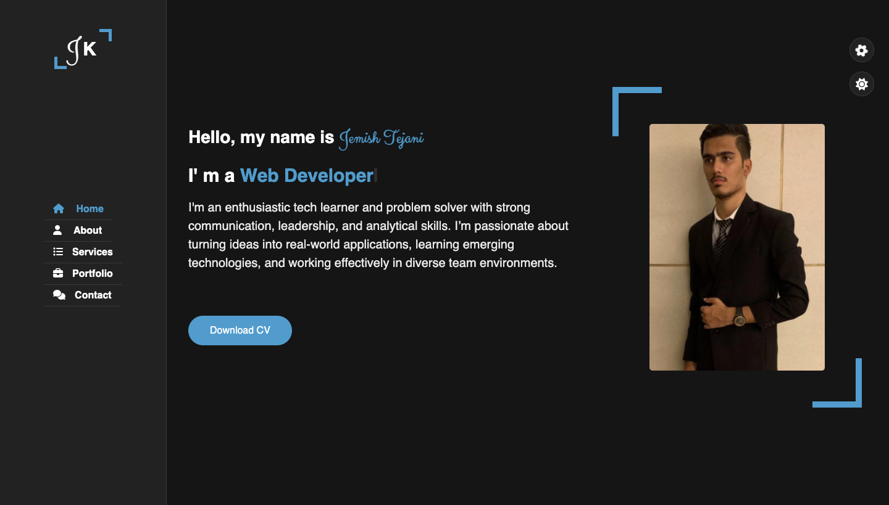
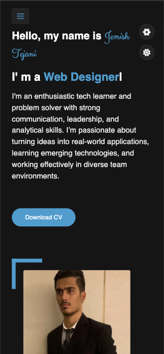

# 💼 Personal Portfolio Website by Jemish Tejani

🚀 A fully responsive and visually appealing personal portfolio website developed using **HTML**, **CSS**, and **JavaScript**. This project is aimed at showcasing my professional profile, technical skills, work experience, and contact details in a clean and modern design.

🔗 **Live Demo**: [jemis-tejani.github.io](https://jemis-tejani.github.io/)

---

## 📌 Features

- ✅ **Fully Responsive Design** – Seamlessly adapts to desktop, tablet, and mobile screens.
- 🎨 **Theme Color Switcher** – Includes 5 customizable color themes with a simple click.
- 🌙 **Dark Mode Toggle** – Easily switch between light and dark mode for better user experience.
- 📄 **Download CV Option** – One-click download button to get my resume in PDF format.
- ✨ **Typing Text Animation** – Smooth typing effect for dynamic introduction using `Typed.js`.
- 🧭 **Smooth Navigation** – Sidebar-based navigation with active section highlight and transitions.
- 📑 **Clean Code Structure** – Neatly organized HTML, CSS, and JS with reusable components.

---

## 📁 Project Folder Structure

```
📦 jemis-tejani/
│
├── 📁 css/
│   ├── style.css
│   ├── style-switcher.css
│   └── skins/
│       ├── color-1.css
│       ├── color-2.css
│       ├── color-3.css
│       ├── color-4.css
│       └── color-5.css
│
├── 📁 js/
│   ├── script.js
│   └── style-switcher.js
│
├── 📁 images/
│   ├── hero.jpg
│   └── portfolio/
│       │
│       ├── portfolio-1.jpeg
│       └── portfolio-2.jpeg
│
├── 📁 Screenshots/
│   ├── desktop.png
│   └── mobile.png
│
├── 📄 index.html
└── 📄 README.md
```

---

## 🖼️ Screenshots

| 💻 Desktop View                     | 📱 Mobile View                    |
| ----------------------------------- | --------------------------------- |
|  |  |

---

## 🛠️ Technologies Used

- **HTML5** – Structure and layout
- **CSS3** – Styling, Flexbox layout, CSS Variables
- **JavaScript (Vanilla)** – Dynamic functionality and interactivity
- **Typed.js** – Typing effect for header content
- **Font Awesome** – Iconography

---

## 🚀 How to Use / Run This Project

1. **Clone this repository:**

   ```bash
   git clone https://github.com/jemis-tejani/jemis-tejani.github.io.git
   ```

2. **Open `index.html` in your browser:**

   - Double-click `index.html` to view the website locally, or
   - Host it online using **GitHub Pages** for live access

3. **Customize the content** as per your needs (images, text, links, etc.)

---

## 🧠 What I Learned

- Creating responsive layouts from scratch using Flexbox and media queries.
- Managing and applying dynamic color themes and dark mode via JavaScript.
- Structuring reusable and maintainable CSS with variables.
- Handling DOM manipulation, class toggling, and event listeners.
- Integrating third-party libraries (like Typed.js) for enhancing UI/UX.

---

## 📄 License

This project is open-source and available under the [MIT License](LICENSE).

---

## 📬 Contact Me

Feel free to reach out to me for freelance work, collaboration, or project inquiries:

- 📧 **Email:** [tejanijemis@gmail.com](mailto:tejanijemis@gmail.com)
- 🌐 **Portfolio:** [jemis-tejani.github.io](https://jemis-tejani.github.io/)
- 💼 **LinkedIn:** [linkedin.com/in/jemish-tejani-031154236](https://linkedin.com/in/jemish-tejani-031154236)

---

## ⭐ Show Your Support

If you like this project or found it useful:

- ⭐ Give it a **Star** on GitHub
- 🔄 **Fork** it and modify for your own use
- 📣 **Share** it with your network

---
